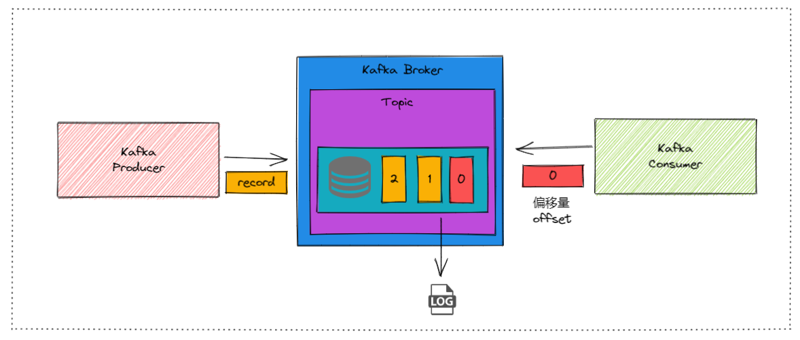
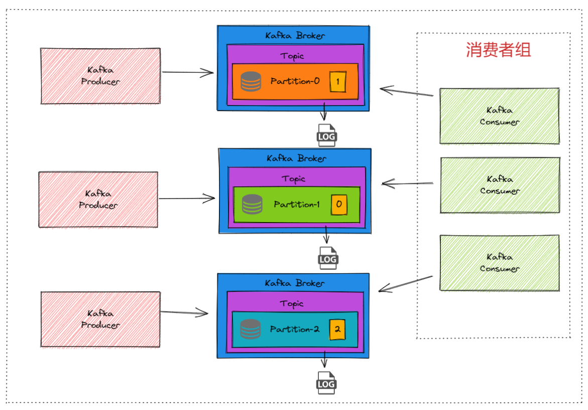
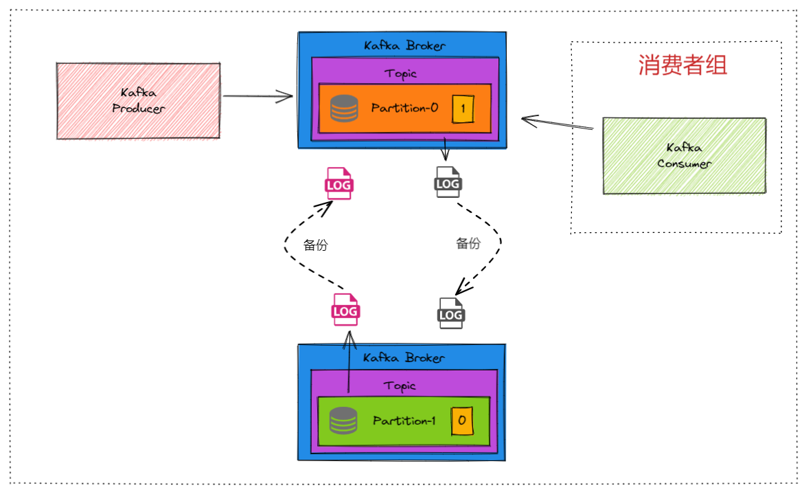

# 1. 单点模型

## 1. 名词概念

1. **Broker**：是指Kafka集群中的一个节点。一个Kafka集群由多个Broker组成，这些Broker共同协作来处理消息的存储、传输和消费。Broker管理一个或多个分区。

2. **Topic**：生产者将消息发送到指定的Topic，消费者订阅Topic以获取消息。Topic本身只是一个逻辑上的分组，不具有物理存储的概念。

3. **Partition**：是Topic的子集，是Kafka中实际存储和处理消息的基本单元。每个Topic可以分成多个Partition，每个Partition都是一个有序的、不可变的消息序列。

4. **Replica**：分区可以存在多副本。

5. **Leader Broker**：分区的多副本下，负责处理所有的读写请求的分区所处的broker。

6. **FollowerBroker**：分区的多副本下，负责同步Leader的数据的分区所处的broker。

生产者把消息（record）发送到kafka，消费者通过偏移量（offset，类似数组的下标）获取数据。

同时每个分区会有自己的Log文件，kafka使用log文件来把数据保存到磁盘。

# 2. 分布式集群-横向扩展

## 1. Topic多分区

### 关于生产

生产者通过Bootstrap Broker连接到Kafka集群。这一步是为了建立初始连接，并获取集群的元数据。

一旦生产者获取了这些元数据，它就知道每个分区的Leader Broker是谁，从而可以将消息直接发送到正确的Leader Broker。

生产者发送消息时必须指定Topic，但是分区是可选的。

* **不指定分区**：如果生产者没有手动指定分区，Kafka会根据默认的分区策略将消息分配到分区。默认的分区策略如下：
  * 如果消息有键（Key），Kafka会根据键的哈希值来确定分区。相同的键总是被分配到同一个分区。
  * 如果消息没有键（Key），Kafka会使用轮询或随机的方式将消息分配到分区，以确保消息分布均匀。
* **指定分区**：生产者也可以在发送消息时明确指定分区。这样，消息会直接发送到指定的分区。

在Kafka中，生产者将消息发送到Broker时，Broker的第一个操作就是将消息记录到磁盘中，以确保消息的持久性和可靠性。

### 关于消费

Kafka中的消费者通常属于一个消费者组（Consumer Group）。每个消费者组有一个唯一的组ID。消费者组的概念用于实现消息的负载均衡和并行消费。

当多个消费者属于同一个组时，Kafka会将Topic的分区分配给组内的消费者。**<mark>每个分区只能由组内的一个消费者消费</mark>**，这样可以实现负载均衡。

* **单个消费者订阅一个Topic**：
  
  * 如果只有一个消费者订阅了一个Topic，那么该消费者会接收到该Topic中的所有消息。

* **多个消费者属于同一个组**：
  
  * Topic中的分区会在组内的消费者之间进行分配。每个分区只会被组内的一个消费者消费。
  * 如果消费者数量多于分区数，多余的消费者将不会分配到任何分区，处于空闲状态。这些消费者可以在有其他消费者退出时自动接管其分区，从而实现高可用性。
  * 如果消费者数量少于分区数，有些消费者会被分配多个分区。

* **多个消费者属于不同的组**：
  
  * 每个组都会独立消费Topic中的所有消息。也就是说，消息会被广播到所有组中的消费者。

### 关于分区新增

Kafka会在集群中创建新的分区。这些新的分区会被分配到不同的Broker，以实现数据的均衡存储和高可用性。Kafka不会自动将现有分区的数据重新分配或均衡到新的分区。新的分区从创建时开始是空的，只有在后续生产者发送消息时，才会向这些新的分区写入数据。消费者组会感知到分区数量的变化，并触发重新平衡。

## 2. 分区多副本

Kafka允许每个分区有多个副本（Replica），这些副本存储在不同的Broker上。一个副本被称为Leader，负责处理所有的读写请求，其他副本为Follower，负责同步Leader的数据。

多个副本同时只有一个副本可以读写，这就是Leader副本，其他副本成为Follower副本，用作备份。
