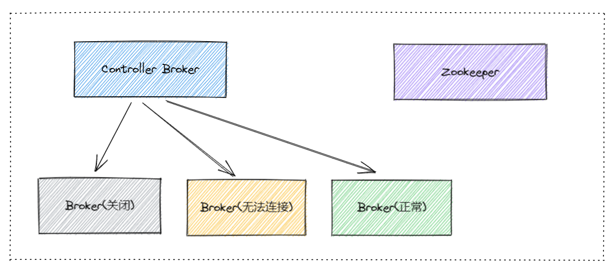
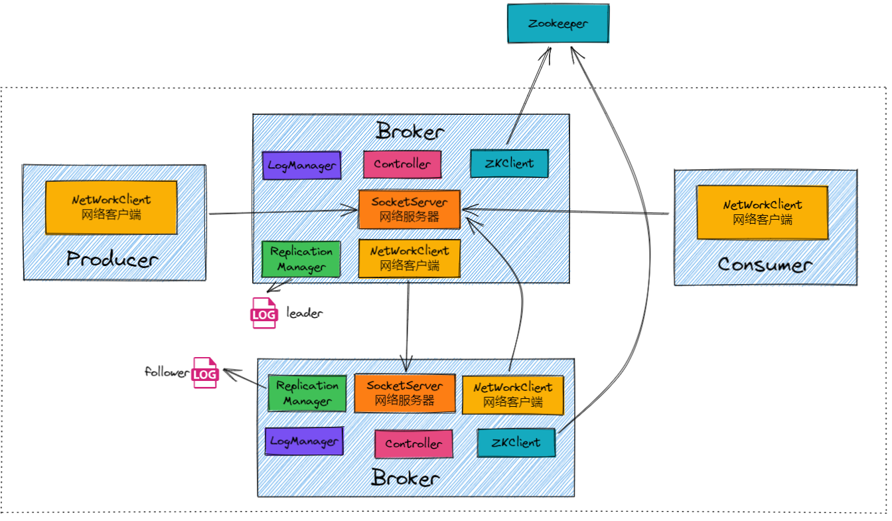

# 1. Controller Broker

Kafka集群中有一个Controller Broker，负责元数据管理和协调。

Kafka使用Zookeeper作为集群元数据的存储和管理工具。Zookeeper保存了集群的状态信息，包括所有的Topic、分区、Leader和副本信息等。

当集群状态发生变化时，Controller Broker会将变更信息写入Zookeeper。

当现任Controller Broker发生故障时，Kafka集群中的其他Broker会检测到这一情况，并通过Zookeeper进行选举。

一个Broker成功竞选为新的Controller Broker后，会从Zookeeper读取最新的集群元数据。

### 保障机制

* **持久化元数据**：Zookeeper持久化存储集群的元数据，确保在任何时刻都可以获取到最新的状态信息。
* **心跳机制**：Broker与Zookeeper之间通过心跳机制保持连接，快速检测Controller Broker的故障。
* **选举机制**：通过Zookeeper的选举机制，能够快速选举出新的Controller Broker，并从Zookeeper同步元数据。

# 2. 组件架构

### 1. Log Manager

`LogManager`主要负责管理Kafka日志（log）的存储和检索。

比如：生产者将消息发送到Partition0的Leader Broker1。`LogManager`在Broker1上将消息写入Partition0的日志文件。

### 2. Replication Manager

`ReplicationManager`主要负责管理分区数据的复制和同步。

每个分区的Leader和Follower之间的同步是独立进行的。也就是说，每个分区都有自己的同步过程，不依赖于其他分区。

虽然每个分区的同步过程是独立的，但每个Broker会为它所管理的每个分区（无论是Leader还是Follower）启动相应的复制线程，这些线程负责处理具体的同步任务。

比如：`ReplicationManager`在Broker1上将新写入的消息推送到Partition0的Follower Broker2和Broker3。`ReplicationManager`在Broker2和Broker3上处理从Broker1接收的复制请求，将消息写入它们各自的日志文件。

### 3. SocketServer

`SocketServer`是Kafka Broker中的一个组件，负责处理网络连接和I/O操作。它负责接受来自客户端和其他Broker的连接请求，并为每个连接分配一个线程进行处理。

### 4. NetworkServer

`NetworkServer`是Kafka的网络通信框架的一个核心部分，负责管理和调度网络请求。它使用了NIO（非阻塞I/O）来处理高并发的网络连接。

### 5. ZKClient

与Zookeeper通信的组件。
