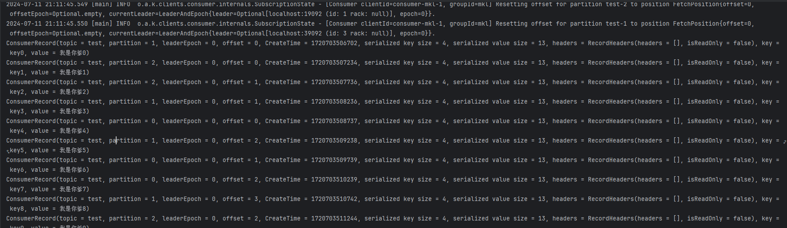

| Docker for Windows | 4.23.0 |
| ------------------ | ------ |
| windows            | 11     |
| Java               | 17     |


# 1. 常用参数

kafka容器常用参数如下

* `-e KAFKA_BROKER_ID=1`：设置 Kafka broker 的 ID 为 1。每个 Kafka broker 都需要一个唯一的 ID。

* `-e KAFKA_ZOOKEEPER_CONNECT=zookeeper:2181`：指定 Kafka 连接到 Zookeeper 的地址，这里假设 Zookeeper 容器的名称为 `zookeeper`，并且它在 2181 端口监听。

* `-e ALLOW_PLAINTEXT_LISTENER=yes`：允许 Kafka 使用纯文本监听器。即允许非加密的通信。

* `-e KAFKA_LISTENERS=PLAINTEXT://0.0.0.0:9092`：Kafka broker 实际监听在容器内的 `0.0.0.0:9092` 上。这意味着 Kafka 接受来自任何网络接口的连接。

* `-e KAFKA_ADVERTISED_LISTENERS=PLAINTEXT://localhost:9092`：指定 Kafka 广播其监听器地址，客户端将使用该地址连接到 broker。在这个例子中，Kafka 广播它在 `localhost:9092` 上监听。

* `KAFKA_LISTENER_SECURITY_PROTOCOL_MAP`：指定 Kafka 使用的监听器协议映射。例如：`PLAINTEXT:PLAINTEXT,SSL:SSL`。

* `KAFKA_INTER_BROKER_LISTENER_NAME`：指定 broker 间通信使用的监听器名称。例如：`PLAINTEXT`。
  
  
  
  

# 2. 理解参数和原理

`KAFKA_LISTENERS`是broker实际监听的地址。

`KAFKA_ADVERTISED_LISTENERS`是broker注册在zookeeper或者controller broker里面的元数据，当消费者或者生产者使用Bootstrap-Server去连接kafka集群时，集群会返回元数据等信息到客户端，客户端会根据每个broker提供的`KAFKA_ADVERTISED_LISTENERS`去连接对应的broker。


所以首先，集群之间，broker之间需要通信，所以每个kafka容器需要设置一个`KAFKA_ADVERTISED_LISTENERS`用于告诉别的容器如何连接到自己，如果容器都是处于同一bridge网络，那么直接使用容器名即可。

其次，我们想要在宿主机比如windows的idea开发，我们一般只能通过docker容器-p暴露的端口去连接kafka，所以每个kafka容器还需要设置一个`KAFKA_ADVERTISED_LISTENERS`来告诉宿主机的客户端，如何连接到自己，这里需要使用localhost+暴露在宿主机的端口。


那么如果`KAFKA_ADVERTISED_LISTENERS`里面有2个地址，如何保证broker之间的连接使用的是容器名，而宿主机客户端使用的是localhost呢？

这需要`KAFKA_INTER_BROKER_LISTENER_NAME`来指定前者。

并且由于`KAFKA_ADVERTISED_LISTENERS`里面有2个地址，所以我们还需要`KAFKA_LISTENER_SECURITY_PROTOCOL_MAP`来映射监听器名字。


# 3. Docker Compose

```yml
version: '3.8'

services:
  zookeeper:
    image: bitnami/zookeeper:3.8.2
    container_name: zookeeper
    environment:
      - ALLOW_ANONYMOUS_LOGIN=yes
    networks:
      - kafka

  kafka1:
    image: bitnami/kafka:3.6.1
    container_name: kafka1
    depends_on:
      - zookeeper
    ports:
      - "19092:9092"
    environment:
      - KAFKA_BROKER_ID=1
      - KAFKA_ZOOKEEPER_CONNECT=zookeeper:2181
      - KAFKA_LISTENERS=INTERNAL://0.0.0.0:9093,EXTERNAL://0.0.0.0:9092
      - KAFKA_ADVERTISED_LISTENERS=INTERNAL://kafka1:9093,EXTERNAL://localhost:19092
      - KAFKA_LISTENER_SECURITY_PROTOCOL_MAP=INTERNAL:PLAINTEXT,EXTERNAL:PLAINTEXT
      - KAFKA_INTER_BROKER_LISTENER_NAME=INTERNAL
    networks:
      - kafka

  kafka2:
    image: bitnami/kafka:3.6.1
    container_name: kafka2
    depends_on:
      - zookeeper
    ports:
      - "29092:9092"
    environment:
      - KAFKA_BROKER_ID=2
      - KAFKA_ZOOKEEPER_CONNECT=zookeeper:2181
      - KAFKA_LISTENERS=INTERNAL://0.0.0.0:9093,EXTERNAL://0.0.0.0:9092
      - KAFKA_ADVERTISED_LISTENERS=INTERNAL://kafka2:9093,EXTERNAL://localhost:29092
      - KAFKA_LISTENER_SECURITY_PROTOCOL_MAP=INTERNAL:PLAINTEXT,EXTERNAL:PLAINTEXT
      - KAFKA_INTER_BROKER_LISTENER_NAME=INTERNAL
    networks:
      - kafka

  kafka3:
    image: bitnami/kafka:3.6.1
    container_name: kafka3
    depends_on:
      - zookeeper
    ports:
      - "39092:9092"
    environment:
      - KAFKA_BROKER_ID=3
      - KAFKA_ZOOKEEPER_CONNECT=zookeeper:2181
      - KAFKA_LISTENERS=INTERNAL://0.0.0.0:9093,EXTERNAL://0.0.0.0:9092
      - KAFKA_ADVERTISED_LISTENERS=INTERNAL://kafka3:9093,EXTERNAL://localhost:39092
      - KAFKA_LISTENER_SECURITY_PROTOCOL_MAP=INTERNAL:PLAINTEXT,EXTERNAL:PLAINTEXT
      - KAFKA_INTER_BROKER_LISTENER_NAME=INTERNAL
    networks:
      - kafka

networks:
  kafka:
    driver: bridge

```

可以看到每个容器都设置了INTERNAL，因为指定了KAFKA_INTER_BROKER_LISTENER_NAME=INTERNAL，所以这是用于broker之间的连接，其监听在本地的`0.0.0.0:9093`，广播给其它broker的通信地址是<容器名>:9093，使用PLAINTEXT（明文）方式通信。


除此之外还设置了EXTERNAL，监听在本地的`0.0.0.0:9092`，广播给客户端的地址是localhost:19092、localhost:29092、localhost:39092，也就是windows上的客户端通过localhost:19092访问broker，这会被docker的-p映射到对应容器的9092，被`0.0.0.0:9092`对接。


# 4. 验证

连接到某个容器。创建test主题。

```shell
kafka-topics.sh --create --topic test --partitions 3 --replication-factor 3 --bootstrap-server kafka1:9093
```

查看分区和副本情况，可以看到在不同的broker上，输出中显示的是Broker ID。

```bash
I have no name!@7212060b6e3d:/$ kafka-topics.sh --describe --topic test --bootstrap-server kafka1:9093
Topic: test     TopicId: Lo1eQ6aCQj6WiFcNiVBrcw PartitionCount: 3       ReplicationFactor: 3    Configs: 
        Topic: test     Partition: 0    Leader: 2       Replicas: 2,3,1 Isr: 2,3,1
        Topic: test     Partition: 1    Leader: 3       Replicas: 3,1,2 Isr: 3,1,2
        Topic: test     Partition: 2    Leader: 1       Replicas: 1,2,3 Isr: 1,2,3
```


引入pom包

```xml
<dependency>
            <groupId>org.apache.kafka</groupId>
            <artifactId>kafka-clients</artifactId>
            <version>3.6.1</version>
        </dependency>
        <!-- SLF4J API -->
        <dependency>
            <groupId>org.slf4j</groupId>
            <artifactId>slf4j-api</artifactId>
            <version>1.7.36</version>
        </dependency>
        <!-- Logback classic (SLF4J implementation) -->
        <dependency>
            <groupId>ch.qos.logback</groupId>
            <artifactId>logback-classic</artifactId>
            <version>1.2.11</version>
        </dependency>
```


生产者代码，通过`localhost:19092`连接到集群。

```java
package org.dragon.producer;

import org.apache.kafka.clients.producer.KafkaProducer;
import org.apache.kafka.clients.producer.ProducerConfig;
import org.apache.kafka.clients.producer.ProducerRecord;
import org.apache.kafka.common.serialization.StringSerializer;

import java.util.HashMap;

public class KafkaProducerTest {
    public static void main(String[] args) throws InterruptedException {
        //创建producer
        HashMap<String, Object> config = new HashMap<>();
        config.put(ProducerConfig.BOOTSTRAP_SERVERS_CONFIG, "localhost:19092");
        config.put(ProducerConfig.KEY_SERIALIZER_CLASS_CONFIG, StringSerializer.class.getName());
        config.put(ProducerConfig.VALUE_SERIALIZER_CLASS_CONFIG, StringSerializer.class.getName());
        KafkaProducer<String, String> producer = new KafkaProducer<String, String>(config);

        for (int i = 0; i < 10; i++) {
            //创建record
            ProducerRecord<String, String> record = new ProducerRecord<String, String>(
                    "test",
                    "key"+i,
                    "我是你爹"+i
            );
            //发送record
            producer.send(record);
            Thread.sleep(500);
        }

        //关闭producer
        producer.close();
    }
}

```

消费者代码，

```java
package org.dragon.consumer;

import org.apache.kafka.clients.consumer.ConsumerConfig;
import org.apache.kafka.clients.consumer.ConsumerRecords;
import org.apache.kafka.clients.consumer.KafkaConsumer;
import org.apache.kafka.common.serialization.StringDeserializer;
import org.apache.kafka.common.serialization.StringSerializer;

import java.util.Collections;
import java.util.HashMap;

public class KafkaConsumerTest {
    public static void main(String[] args) {

        // 创建消费者对象
        HashMap<String, Object> config = new HashMap<>();
        config.put(ConsumerConfig.BOOTSTRAP_SERVERS_CONFIG, "localhost:19092");
        config.put(ConsumerConfig.KEY_DESERIALIZER_CLASS_CONFIG, StringDeserializer.class.getName());
        config.put(ConsumerConfig.VALUE_DESERIALIZER_CLASS_CONFIG, StringDeserializer.class.getName());

        config.put(ConsumerConfig.GROUP_ID_CONFIG, "mkl");

        KafkaConsumer<String, String> kafkaConsumer = new KafkaConsumer<String, String>(config);
        // 消费者订阅主题
        kafkaConsumer.subscribe(Collections.singletonList("test"));

        try {
            while (true){
                // 消费者拉取消息
                ConsumerRecords<String, String> records = kafkaConsumer.poll(100);
                records.forEach(System.out::println);
            }
        }finally {
            // 消费者关闭
            kafkaConsumer.close();
        }
    }
}

```

都启动后，消费者和生产者日志正常。


