# 1. Topic多分区

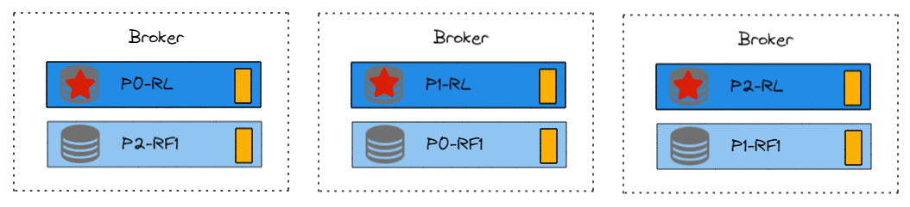

如图，是一个多分区Topic在Kafka集群中可能得分配情况。

P0-RL代表分区0，Leader副本。


这个Topic是3分区2副本的配置。分区尽量均匀分在不同的Broker上，分区的Follower副本尽量不和Leader在一个Broker上。


# 2. 理想的策略

假设有3个Topic在含有3个Broker的Kafka集群上。

Topic1有1个分区，2个副本。

Topic2有2个分区，2个副本。

Topic3有3个分区，2个副本。

可能如下图所示。不同颜色表示不同Topic。

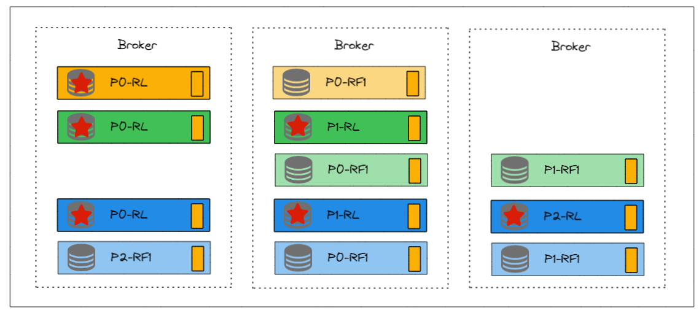

似乎不是特别理想，我们再调整一下，如下图

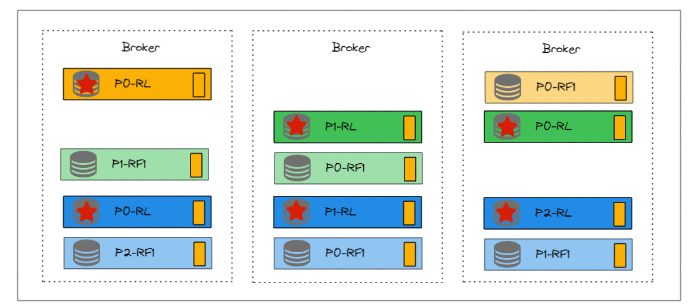

不仅每个Broker的副本数一样了，更关键的是，并且每个Broker的主Leader副本也一样的。这样更适合负载均衡。


# 3. 实际的策略

我们使用Kafka tool，来以此创建上述3个Topic。

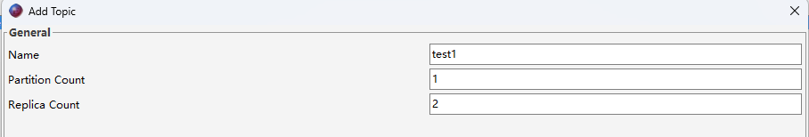

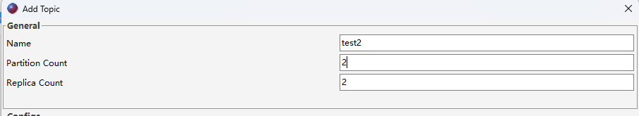

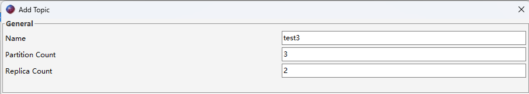

首先看test1

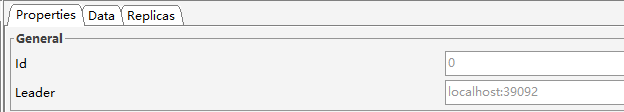

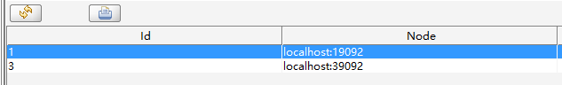

然后看test2

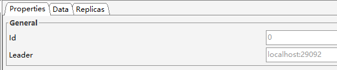

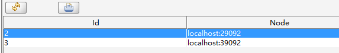

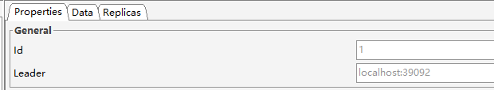

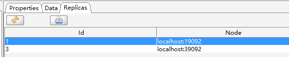

然后是test3

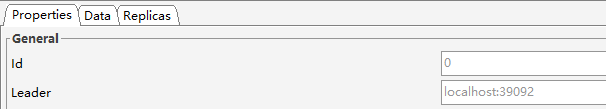

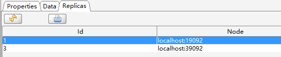

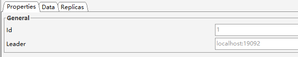

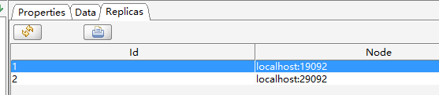

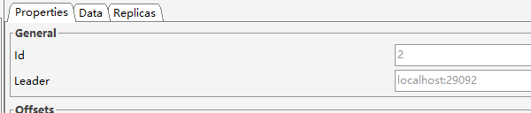

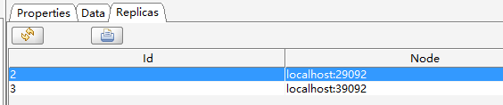

按照上面的信息，画出来的分配结果如下图

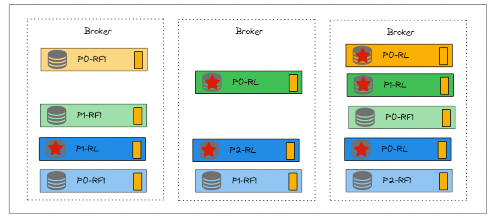

似乎并不和我们想的一样。


查看源码，`Breadcrumbskafka/server-common/src/main/java/org/apache/kafka/admin/AdminUtils.java`中一段代码

```java
private static Map<Integer, List<Integer>> assignReplicasToBrokersRackUnaware(int nPartitions,
                                                                                  int replicationFactor,
                                                                                  List<Integer> brokerList,
                                                                                  int fixedStartIndex,
                                                                                  int startPartitionId) {
        Map<Integer, List<Integer>> ret = new HashMap<>();
        int startIndex = fixedStartIndex >= 0 ? fixedStartIndex : RAND.nextInt(brokerList.size());
        int currentPartitionId = Math.max(0, startPartitionId);
        int nextReplicaShift = fixedStartIndex >= 0 ? fixedStartIndex : RAND.nextInt(brokerList.size());
        for (int i = 0; i < nPartitions; i++) {
            if (currentPartitionId > 0 && (currentPartitionId % brokerList.size() == 0))
                nextReplicaShift += 1;
            int firstReplicaIndex = (currentPartitionId + startIndex) % brokerList.size();
            List<Integer> replicaBuffer = new ArrayList<>();
            replicaBuffer.add(brokerList.get(firstReplicaIndex));
            for (int j = 0; j < replicationFactor - 1; j++)
                replicaBuffer.add(brokerList.get(replicaIndex(firstReplicaIndex, nextReplicaShift, j, brokerList.size())));
            ret.put(currentPartitionId, replicaBuffer);
            currentPartitionId += 1;
        }
        return ret;
    }
```

例子（来自尚硅谷）

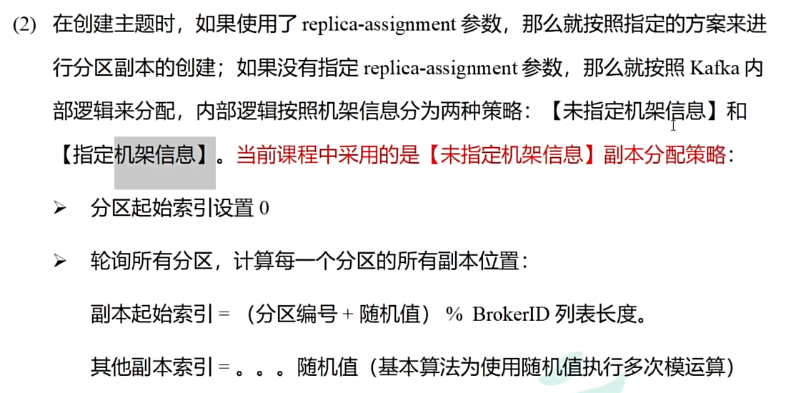

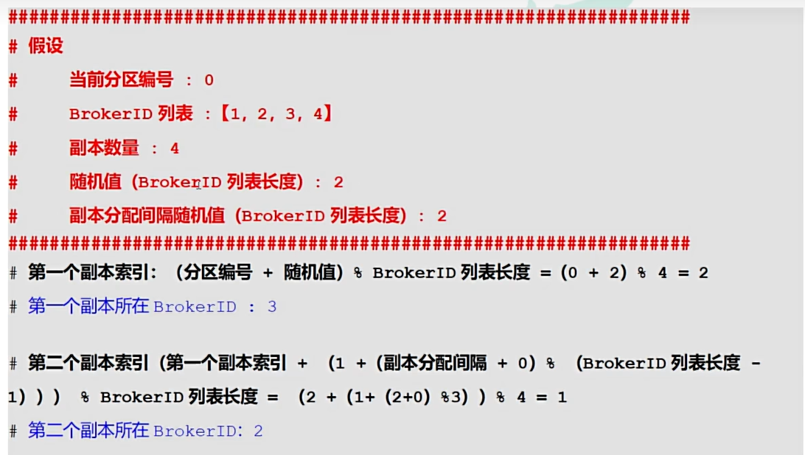

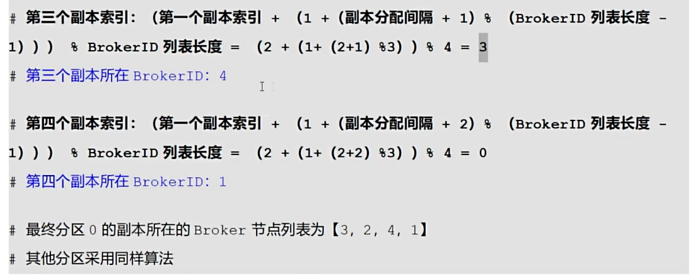


# 4. 如何自定义策略

```java
public class AdminTopicTest {
    public static void main(String[] args) {
        //定义kafka集群配置
        Map<String, Object> config = new HashMap<>();
        config.put(AdminClientConfig.BOOTSTRAP_SERVERS_CONFIG, "localhost:19092");

        //创建Admin管理员对象
        Admin admin = Admin.create(config);

        //定义Topic属性
        HashMap<Integer, List<Integer>> map = new HashMap<>();
        // 分区0，Leader副本在3上，第二个副本在1上。
        map.put(0, Arrays.asList(3, 1));
        map.put(1, Arrays.asList(2, 3));
        map.put(2, Arrays.asList(1, 2));
        NewTopic test4 = new NewTopic("test2", map);


        //创建Topic
        CreateTopicsResult result = admin.createTopics(
                Arrays.asList(
                        test4
                )
        );

        admin.close();
    }
}
```

不过在手动分配时，确实需要了解每个broker的负载情况，以便做出更优的分配策略。你可以使用Kafka的`AdminClient`类来获取集群的状态信息


