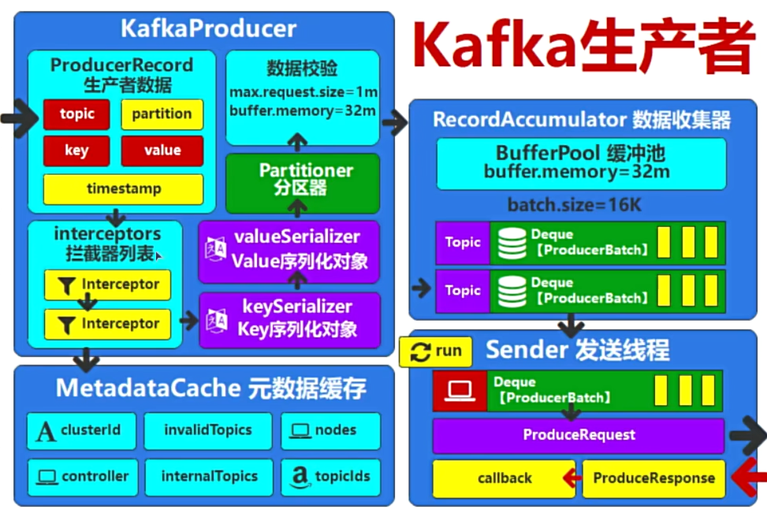
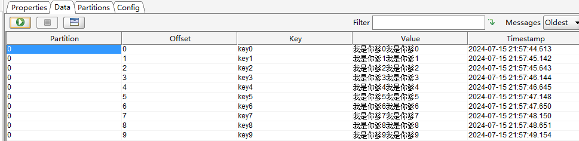

# 1. Producer流程



新建ProducerRecord类后，传入topic、key、value等数据构建Record之后，距离发送至kafka集群还需要经历若干过程。

1. 拦截器列表，对数据进行过滤，更改等行为，处理异常不会导致流程终止。

2. 获取Kafka集群元数据

3. 对数据进行序列化

4. 根据元数据选择分区和Broker

5. 数据校验

6. 进入数据发送缓存区，批次发送

7. send


# 2. 代码测试

```java
public class KafkaProducerInterceptorTest {
    public static void main(String[] args) throws InterruptedException {
        //创建producer
        HashMap<String, Object> config = new HashMap<>();
        config.put(ProducerConfig.BOOTSTRAP_SERVERS_CONFIG, "localhost:19092");
        config.put(ProducerConfig.KEY_SERIALIZER_CLASS_CONFIG, StringSerializer.class.getName());
        config.put(ProducerConfig.VALUE_SERIALIZER_CLASS_CONFIG, StringSerializer.class.getName());
        //指定拦截器
        config.put(ProducerConfig.INTERCEPTOR_CLASSES_CONFIG, ValueInterceptorTest.class.getName());
        KafkaProducer<String, String> producer = new KafkaProducer<String, String>(config);

        for (int i = 0; i < 10; i++) {
            //创建record
            ProducerRecord<String, String> record = new ProducerRecord<String, String>(
                    "test1",
                    "key"+i,
                    "我是你爹"+i
            );
            //发送record
            producer.send(record);
            Thread.sleep(500);
        }

        //关闭producer
        producer.close();
    }
}
```

拦截器自定义类

```java
package org.dragon.producer;

import org.apache.kafka.clients.producer.ProducerInterceptor;
import org.apache.kafka.clients.producer.ProducerRecord;
import org.apache.kafka.clients.producer.RecordMetadata;

import java.util.Map;

/**
 * 自定义value拦截器试验<br/>
 * 1. 实现接口
 * 2. 定义泛型
 * 3. 重写方法
 *
 *
 * @author mumu
 * @date 2024/07/15
 */
public class ValueInterceptorTest implements ProducerInterceptor<String, String> {

    /**
     * 发送数据时会调用这个方法<br/>
     * 让value复制2次
     *
     * @param producerRecord 生产者记录
     * @return {@link ProducerRecord}<{@link String}, {@link String}>
     */
    @Override
    public ProducerRecord<String, String> onSend(ProducerRecord<String, String> producerRecord) {
        return new ProducerRecord<String, String>(producerRecord.topic(), producerRecord.key(), producerRecord.value() + producerRecord.value());
    }

    /**
     * 发送数据完毕，服务器返回的响应，会调用此方法。
     *
     * @param recordMetadata 记录元数据
     * @param e              e
     */
    @Override
    public void onAcknowledgement(RecordMetadata recordMetadata, Exception e) {

    }

    /**
     * 生产者关闭，会调用此方法
     */
    @Override
    public void close() {

    }

    /**
     * 创建生产者对象时调用
     *
     * @param map 地图
     */
    @Override
    public void configure(Map<String, ?> map) {

    }
}

```


# 3. 测试结果

可以看到value是复制了2次，成功。


