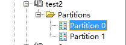
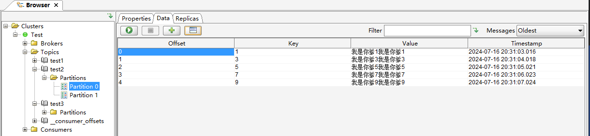
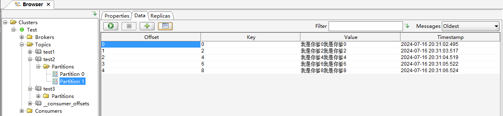

# 1. Partitioner分区器


`clients/src/main/java/org/apache/kafka/clients/producer/KafkaProducer.java`，中doSend方法，记录了生产者将消息发送的流程，其中有一步就是计算当前消息应该发送往对应Topic哪一个分区，

```java
int partition = partition(record, serializedKey, serializedValue, cluster);
```

```java

private final Partitioner partitioner;

private int partition(ProducerRecord<K, V> record, byte[] serializedKey, byte[] serializedValue, Cluster cluster) {
        //当record的分区已存在，则直接返回，这对应了创建Record时可以手动传入partition参数
        if (record.partition() != null)
            return record.partition();

        // 如果存在partitioner分区器，则使用Partitioner.partition方法计算分区数据
        if (partitioner != null) {
            int customPartition = partitioner.partition(
                record.topic(), record.key(), serializedKey, record.value(), serializedValue, cluster);
            if (customPartition < 0) {
                throw new IllegalArgumentException(String.format(
                    "The partitioner generated an invalid partition number: %d. Partition number should always be non-negative.", customPartition));
            }
            return customPartition;
        }


        // 如果没有分区器的情况
        if (serializedKey != null && !partitionerIgnoreKeys) {
            // hash the keyBytes to choose a partition
            return BuiltInPartitioner.partitionForKey(serializedKey, cluster.partitionsForTopic(record.topic()).size());
        } else {
            return RecordMetadata.UNKNOWN_PARTITION;
        }
    }


// 利用键的哈希值来选择分区
public static int partitionForKey(final byte[] serializedKey, final int numPartitions) {
        return Utils.toPositive(Utils.murmur2(serializedKey)) % numPartitions;
    }
```


# 2. 自定义分区器

新建类实现`Partitioner`接口，key是字符串数字，奇数送到分区0，偶数送到分区1 。

```java
public class MyKafkaPartitioner implements Partitioner {
    @Override
    public int partition(String s, Object key, byte[] bytes, Object o1, byte[] bytes1, Cluster cluster) {
        // Ensure the key is a non-null string
        if (key == null || !(key instanceof String)) {
            throw new IllegalArgumentException("Key must be a non-null String");
        }

        // Parse the key as an integer
        int keyInt;
        try {
            keyInt = Integer.parseInt((String) key);
        } catch (NumberFormatException e) {
            throw new IllegalArgumentException("Key must be a numeric string", e);
        }

        // Determine the partition based on the key's odd/even nature
        if (keyInt % 2 == 0) {
            return 1; // Even keys go to partition 2
        } else {
            return 0; // Odd keys go to partition 0
        }
    }

    @Override
    public void close() {

    }

    @Override
    public void configure(Map<String, ?> map) {

    }
}
```

新建一个存在多分区的Topic。




```java
public class KafkaProducerPartitionorTest {
    public static void main(String[] args) throws InterruptedException {
        //创建producer
        HashMap<String, Object> config = new HashMap<>();
        config.put(ProducerConfig.BOOTSTRAP_SERVERS_CONFIG, "localhost:19092");
        config.put(ProducerConfig.KEY_SERIALIZER_CLASS_CONFIG, StringSerializer.class.getName());
        config.put(ProducerConfig.VALUE_SERIALIZER_CLASS_CONFIG, StringSerializer.class.getName());
        //指定拦截器
        config.put(ProducerConfig.INTERCEPTOR_CLASSES_CONFIG, ValueInterceptorTest.class.getName());
        //指定分区器
        config.put(ProducerConfig.PARTITIONER_CLASS_CONFIG, MyKafkaPartitioner.class.getName());

        KafkaProducer<String, String> producer = new KafkaProducer<String, String>(config);

        for (int i = 0; i < 10; i++) {
            //创建record
            ProducerRecord<String, String> record = new ProducerRecord<String, String>(
                    "test1",
                    "key"+i,
                    "我是你爹"+i
            );
            //发送record
            producer.send(record);
            Thread.sleep(500);
        }

        //关闭producer
        producer.close();
    }
}
```

配置好`PARTITIONER_CLASS_CONFIG`后发送消息。





可以分区器成功起作用了。


# 3. RecordAccumulator数据收集器

通过数据校验后，数据从`分区器`来到`数据收集器`。

数据收集器的工作机制

1. **队列缓存**：`RecordAccumulator`为每个分区维护一个队列。默认情况下，每个队列的批次大小（buffer size）是16KB，这个大小可以通过配置参数`batch.size`来调整。

2. **缓冲区管理**：
   
   * 每个分区都有一个或多个批次，每个批次包含多条消息。
   * 当一个批次填满（即达到`batch.size`），或者达到发送条件（如`linger.ms`时间窗口，即发送消息前等待的时间）时，批次会被标记为可发送状态，并被传递给`Sender`线程。

3. **满批次处理**：
   
   * 当某个分区的队列中的某个批次大小超过了16KB（默认值）或满足`linger.ms`的时间条件，`RecordAccumulator`会将该批次加入到一个待发送的队列中。
   * `Sender`线程会从待发送队列中获取这些满批次并将其发送到Kafka集群。


