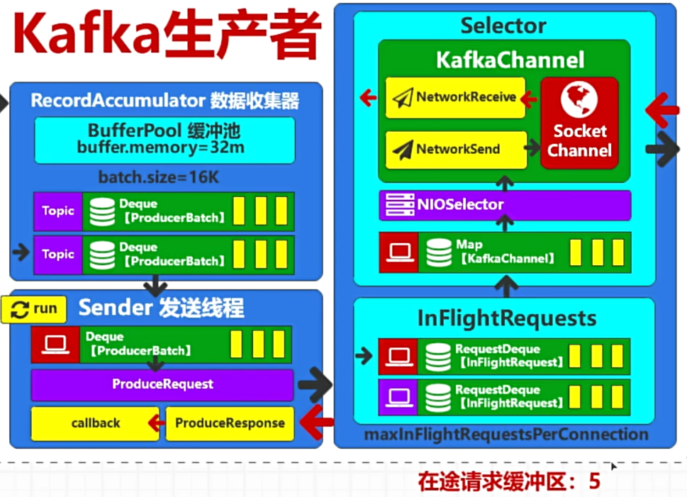

# 1. Sender发送数据

`Sender`线程负责将已经在`RecordAccumulator`中准备好的消息批次发送到Kafka集群。虽然消息在`RecordAccumulator`中是按照分区组织的，但`Sender`线程在发送这些消息时，会按照broker而不是分区来组织发送。这有助于提高发送效率和减少网络开销。

### 1. 发送数据的详细过程：

1. **拉取批次**：`Sender`线程从`RecordAccumulator`中拉取已准备好发送的消息批次。这些批次可能来自多个分区。

2. **按broker组织批次**：`Sender`线程会将这些批次按目标broker进行组织，因为一个broker通常负责多个分区的消息处理。这个过程涉及以下步骤：
   
   * 确定每个分区的leader broker。
   * 将属于同一个broker的所有分区的批次组合在一起。

3. **发送请求**：`Sender`线程会为每个broker创建一个或多个Produce请求（ProduceRequest），然后通过网络将这些请求发送到对应的broker。这些请求包含了该broker负责的所有分区的消息批次。

4. **处理响应**：`Sender`线程会等待broker的响应。响应中包含了每个分区的消息是否成功写入的信息。
   
   * 如果某个分区的消息写入失败，`Sender`线程会根据重试机制重试发送这些消息。
   * 如果所有消息都成功写入，`Sender`线程会从`RecordAccumulator`中移除这些消息批次。

### 2. 关键参数配置

以下是一些关键参数，可以影响`Sender`线程的行为：

* `max.in.flight.requests.per.connection`：每个连接允许的最大未完成请求数。默认值为5。如果这个值过大，可能会导致消息重排序。
* `request.timeout.ms`：请求超时时间。默认值为30秒。如果broker在此时间内没有响应，`Sender`线程会重试或失败。
* `retries`：重试次数。默认值为0。指定`Sender`线程在发送消息失败时的重试次数。
* `retry.backoff.ms`：重试间隔时间。默认值为100ms。指定每次重试之间的等待时间。

通过这些配置，Kafka生产者可以在不同的网络条件和负载下优化消息发送的效率和可靠性。

在Kafka生产者的`Sender`线程工作流程中，如果一次任务中包含了来自多个分区的批次，并且这些批次涉及到多个broker，那么`Sender`线程会分别向这些broker发送请求

# 2. 在途请求缓存区

* **存储在途请求**：当`Sender`线程将消息批次发送到broker后，这些请求会存储在在途请求缓存区中，直到收到broker的确认响应。这个缓存区的大小由配置参数`max.in.flight.requests.per.connection`决定。

* **重试机制**：如果某个请求在指定时间内没有收到响应，生产者会根据配置的重试机制重新发送这些请求。重试机制配置参数包括`retries`和`retry.backoff.ms`。

* **顺序保证**：`max.in.flight.requests.per.connection`参数设置了每个连接（每个生产者和Kafka的连接）允许的最大未完成请求数。默认值是5。如果这个值设置过大，可能会导致消息重排序问题，特别是在启用了重试机制时。设置合适的值可以平衡并发性能和消息顺序保证。

* **资源管理**：在途请求缓存区的大小会影响生产者的内存使用和性能。如果在途请求过多，可能会占用大量内存资源，导致生产者性能下降。因此，合理设置这个缓存区的大小是优化生产者性能的关键。

