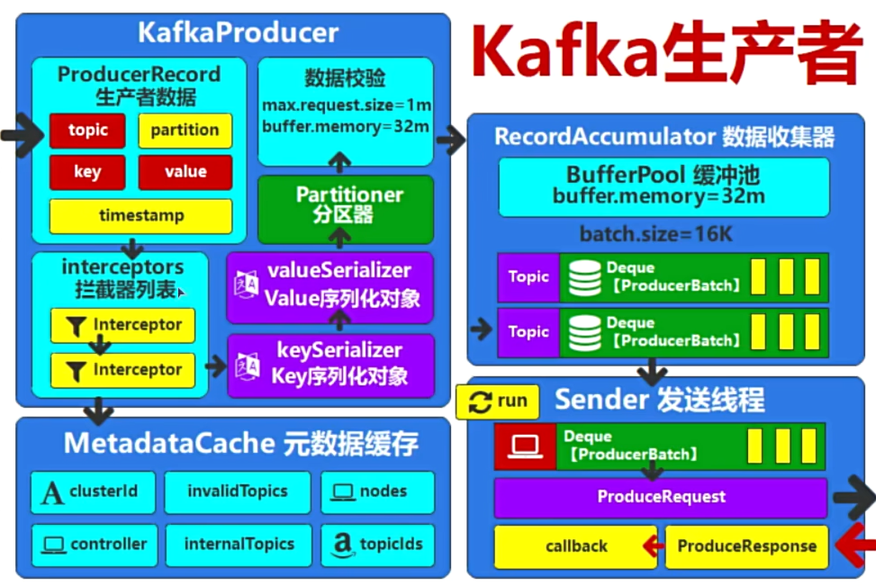

# 1. 异步发送

Kafka默认就是异步发送，在Main线程中的多条消息，没有严格的先后顺序，Sender发送后就继续下一条，异步接受结果。

```java
public class KafkaProducerCallbackTest {
    public static void main(String[] args) throws InterruptedException {
        //创建producer
        HashMap<String, Object> config = new HashMap<>();
        config.put(ProducerConfig.BOOTSTRAP_SERVERS_CONFIG, "localhost:19092");
        config.put(ProducerConfig.KEY_SERIALIZER_CLASS_CONFIG, StringSerializer.class.getName());
        config.put(ProducerConfig.VALUE_SERIALIZER_CLASS_CONFIG, StringSerializer.class.getName());

        KafkaProducer<String, String> producer = new KafkaProducer<String, String>(config);

        for (int i = 0; i < 10; i++) {
            //创建record
            ProducerRecord<String, String> record = new ProducerRecord<String, String>(
                    "test2",
                    ""+i,
                    "我是你爹"+i
            );
            //发送record
            producer.send(record, new Callback() {
                @Override
                public void onCompletion(RecordMetadata recordMetadata, Exception e) {
                    System.out.println("回调信息：消息发送成功");
                }
            });
            System.out.println("发送数据");
        }

        //关闭producer
        producer.close();
    }
}
```

Main线程中，对于多条数据，下一条消息的发送并不等待上一条消息的确认，而是继续发送。

```textile
2024-07-17 21:43:46.052 [kafka-producer-network-thread | producer-1] INFO  org.apache.kafka.clients.Metadata - [Producer clientId=producer-1] Cluster ID: BqIgDGtwTeeusL_ygHtn2w
发送数据
发送数据
发送数据
发送数据
发送数据
发送数据
发送数据
发送数据
发送数据
发送数据
2024-07-17 21:43:46.075 [main] INFO  org.apache.kafka.clients.producer.KafkaProducer - [Producer clientId=producer-1] Closing the Kafka producer with timeoutMillis = 9223372036854775807 ms.
2024-07-17 21:43:46.280 [kafka-producer-network-thread | producer-1] INFO  o.a.k.c.producer.internals.TransactionManager - [Producer clientId=producer-1] ProducerId set to 6000 with epoch 0
回调信息：消息发送成功
回调信息：消息发送成功
回调信息：消息发送成功
回调信息：消息发送成功
回调信息：消息发送成功
回调信息：消息发送成功
回调信息：消息发送成功
回调信息：消息发送成功
回调信息：消息发送成功
回调信息：消息发送成功
2024-07-17 21:43:46.569 [main] INFO  org.apache.kafka.common.metrics.Metrics - Metrics scheduler closed
```

可以看到先是main线程循环发送完了多条数据，然后再异步收到通知。


# 2. 同步发送

消息有严格的先后顺序，下一条消息必须等到上一条消息的回调确认后，再发送，这是一个<mark>效率极低</mark>的过程。

按照流程图，上一条消息需要从生产者一直流转，多个步骤，到数据收集器，到Sender，最后还要等待回调确认，才可以开始下一条消息的流转。

```java
public class KafkaProducerCallbackTest {
    public static void main(String[] args) throws InterruptedException, ExecutionException {
        //创建producer
        HashMap<String, Object> config = new HashMap<>();
        config.put(ProducerConfig.BOOTSTRAP_SERVERS_CONFIG, "localhost:19092");
        config.put(ProducerConfig.KEY_SERIALIZER_CLASS_CONFIG, StringSerializer.class.getName());
        config.put(ProducerConfig.VALUE_SERIALIZER_CLASS_CONFIG, StringSerializer.class.getName());

        KafkaProducer<String, String> producer = new KafkaProducer<String, String>(config);

        for (int i = 0; i < 10; i++) {
            //创建record
            ProducerRecord<String, String> record = new ProducerRecord<String, String>(
                    "test2",
                    ""+i,
                    "我是你爹"+i
            );
            //发送record
            Future<RecordMetadata> send = producer.send(record, new Callback() {
                @Override
                public void onCompletion(RecordMetadata recordMetadata, Exception e) {
                    System.out.println("回调信息：消息发送成功");
                }
            });
            System.out.println("发送数据");
            send.get();
        }

        //关闭producer
        producer.close();
    }
}
```


```textile
2024-07-17 21:49:19.586 [kafka-producer-network-thread | producer-1] INFO  o.a.k.c.producer.internals.TransactionManager - [Producer clientId=producer-1] ProducerId set to 5000 with epoch 0
发送数据
回调信息：消息发送成功
发送数据
回调信息：消息发送成功
发送数据
回调信息：消息发送成功
发送数据
回调信息：消息发送成功
发送数据
回调信息：消息发送成功
发送数据
回调信息：消息发送成功
发送数据
回调信息：消息发送成功
发送数据
回调信息：消息发送成功
发送数据
回调信息：消息发送成功
发送数据
回调信息：消息发送成功
2024-07-17 21:49:19.823 [main] INFO  org.apache.kafka.clients.producer.KafkaProducer - [Producer clientId=producer-1] Closing the Kafka producer with timeoutMillis = 9223372036854775807 ms.
2024-07-17 21:49:19.838 [main] INFO  org.apache.kafka.common.metrics.Metrics - Metrics scheduler closed
```


