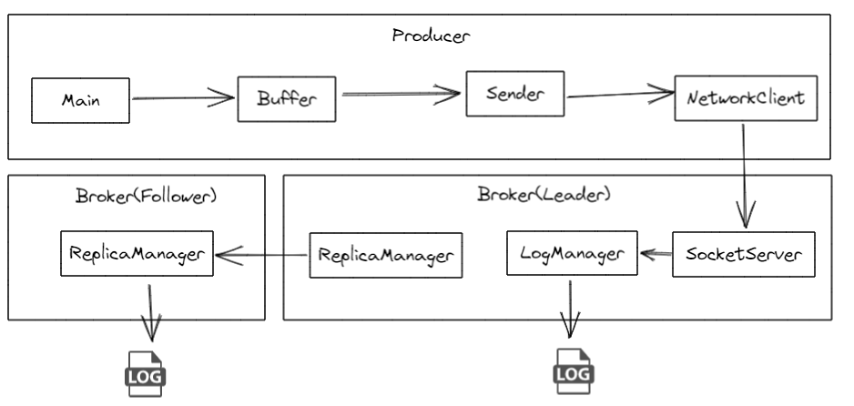
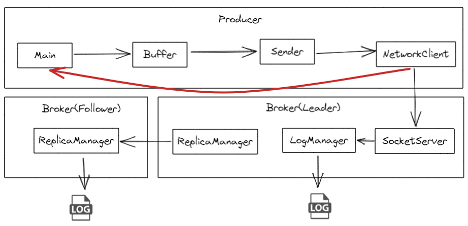
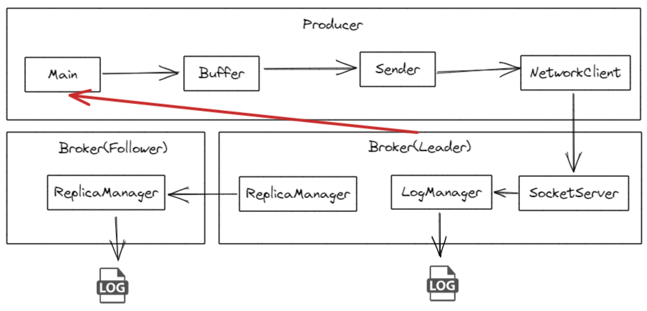
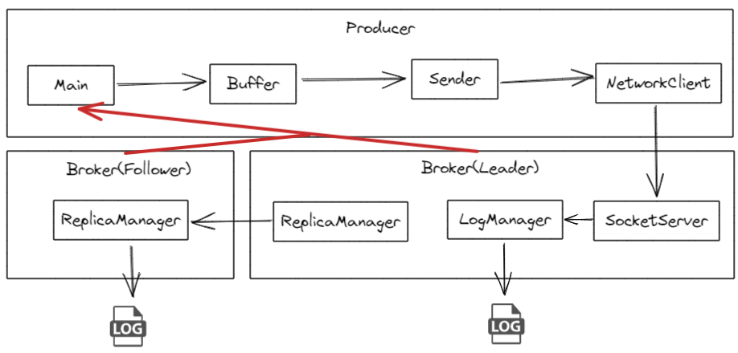

# 1. 应答机制

异步发送的效率高，但是不安全，同步发送安全，但是效率低。

无论哪一种，有一个关键的步骤叫做回调，也就是ACKS应答机制。

其中ACKS也分为3个等级。默认等级是all。

| 等级      | 效率  | 安全   |
| ------- | --- | ---- |
| all（-1） | 效率低 | 安全性高 |
| 1       | 效率中 | 安全性中 |
| 0       | 效率高 | 安全性低 |

# 2. 等级0

* 生产者发送消息到Kafka集群。
* 消息进入网络发送队列。
* 生产者立即返回（认为消息已发送），不等待任何Broker的确认。

# 3. 等级1

* 生产者发送消息到Kafka集群。
* Leader分区接收消息，将消息写入本地日志。
* Leader分区将消息同步到磁盘（如果配置了日志刷新）。
* Leader分区返回确认（ACK）给生产者。
* 生产者收到ACK，继续处理下一条消息。

# 4. 等级all

* 生产者发送消息到Kafka集群。
* Leader分区接收消息，将消息写入本地日志。
* Leader分区将消息同步到磁盘（如果配置了日志刷新）。
* Leader分区将消息发送给所有同步副本（ISR）。
* 每个同步副本（Follower）将消息写入本地日志并返回确认给Leader。
* Leader分区收到所有同步副本的确认后，返回ACK给生产者。
* 生产者收到ACK，继续处理下一条消息。

# 5. ISR

ISR的定义：

* **成员**：ISR包括Leader和所有与Leader保持同步的Follower分区。保持同步的标准是Follower分区的日志不落后于Leader分区超过指定的时间（由`replica.lag.time.max.ms`配置）。
* **目的**：确保在Leader发生故障时，可以迅速从ISR中选举一个新的Leader，从而保证分区的高可用性。
  
  

ISR的动态调整：

* Kafka会动态调整ISR的成员。如果一个Follower分区落后于Leader超过一定的时间，Kafka会将其从ISR中移除。
* 当该Follower分区重新追上Leader并满足同步标准时，Kafka会将其重新加入ISR。

