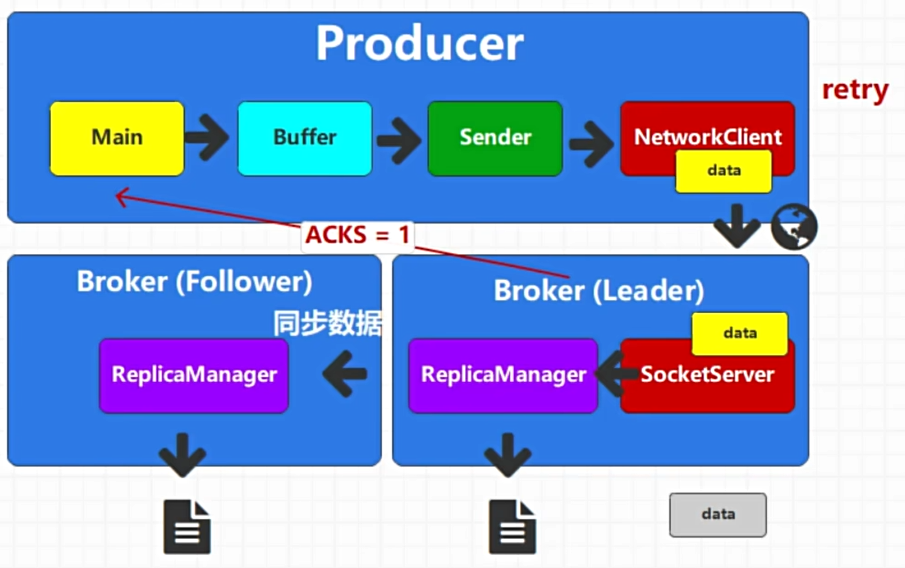
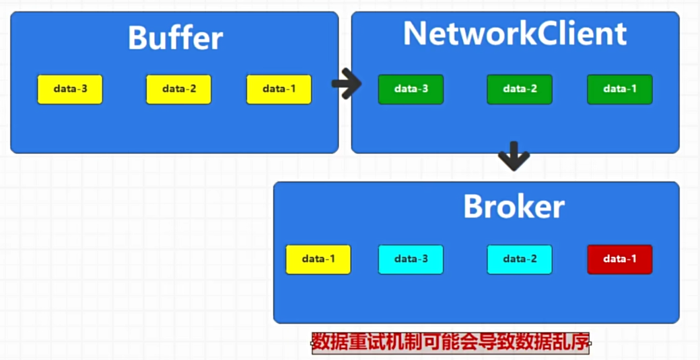

为了可靠性，Kafka有消息重试机制，但是同时也带来了2大问题

# 1. 数据重复

消息发送到broker后，broker记录消息数据到log中，但是由于网络问题，producer没有收到acks，于是再次发送消息。

除此之外，也可能是其他场景，导致了消息的重复。

# 2. 数据乱序

如图，消息2、3发送到了broker，但是data1因为网络问题没有到broker，然后被producer重试了，第二次到了，但是顺序乱了。

