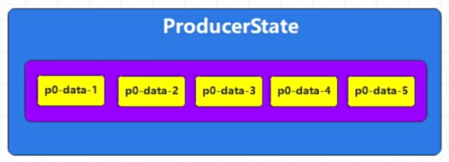

幂等性通过消耗时间和性能的方式，解决乱序和重复问题。

但是只能保证<mark>同一生产者在一个分区中的幂等性</mark>。


# 1. 启用幂等性

```java
        //创建producer
        HashMap<String, Object> config = new HashMap<>();
        config.put(ProducerConfig.BOOTSTRAP_SERVERS_CONFIG, "localhost:19092");
        config.put(ProducerConfig.KEY_SERIALIZER_CLASS_CONFIG, StringSerializer.class.getName());
        config.put(ProducerConfig.VALUE_SERIALIZER_CLASS_CONFIG, StringSerializer.class.getName());
        //配置acks等级
        config.put(ProducerConfig.ACKS_CONFIG, "-1");
        //启用幂等性
        config.put(ProducerConfig.ENABLE_IDEMPOTENCE_CONFIG, true);
        // 消息失败重试次数
        config.put(ProducerConfig.RETRIES_CONFIG, 5);
        config.put(ProducerConfig.REQUEST_TIMEOUT_MS_CONFIG, 3000);

        KafkaProducer<String, String> producer = new KafkaProducer<String, String>(config);
```

幂等性操作要求：

1. ACKS = -1

2. 开启重试机制

3. 在途请求缓冲区不能大于5
   
   

# 2. 底层变化

消息会被标记，包含生产者ID和消息序列号。

( 如果生产者重启，那么ID会变化，这会使得下图记录无效，幂等性短暂失效。)

并且broker中的ProducerState会记录每个分区的生产者状态，包括最新5个消息的序列号。




# 3. 数据不重复

消息来到broker分区，经由ProducerState的数据进行对比，

* 重复则丢弃消息，返回ack。

* 否则Broker存储消息并返回ack。
  
  

# 4. 数据有序

消息来到broker分区，经由ProducerState的数据进行对比，

* 如果新消息的序列号是连续的，Broker会接受并存储该消息，然后更新最新序列号。
* 如果新消息的序列号不连续，Broker会认为这是重复消息或乱序消息，根据配置，它可能会丢弃或拒绝该消息。
* 无论消息被接受还是丢弃，Broker都会返回一个ack给生产者。

不连续时可能拒绝多个消息，那么这些消息都会返回生产者重新发送，直到按顺序下一个消息到来，才存储并更新。
