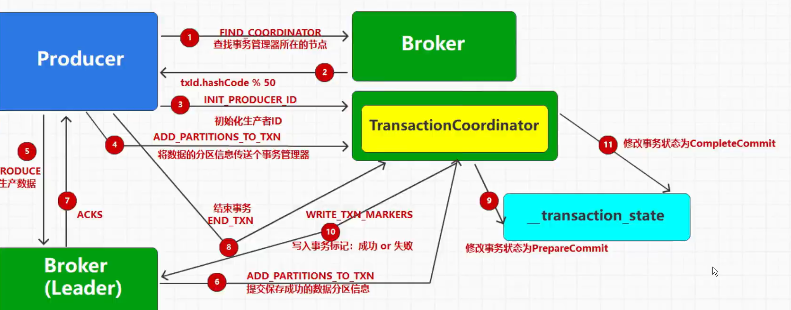

事务性可以防止跨会话幂等性失效，同时也可以保证单个生产者的指定数据，要么全部成功要么全部失败，<mark>不限分区</mark>。不可以多个生产者共用相同的事务ID。


# 1. 跨会话幂等性失效

幂等性开启后，broker会对每个分区记录生产者状态，并且生产者具有PID，消息被标记为PID加上序列号，数据重复和有序都是在其基础之上运作的。

生产者重启等因素会导致PID变化，导致幂等性短暂失效。


# 2. 开启事务

因为事务是基于幂等性的，所以幂等性的配置都要有。

```java
package org.dragon.producer;

import org.apache.kafka.clients.producer.*;
import org.apache.kafka.common.serialization.StringSerializer;

import java.util.HashMap;
import java.util.concurrent.ExecutionException;
import java.util.concurrent.Future;

public class KafkaProducerTransactionTest {
    public static void main(String[] args) throws InterruptedException, ExecutionException {
        //创建producer
        HashMap<String, Object> config = new HashMap<>();
        config.put(ProducerConfig.BOOTSTRAP_SERVERS_CONFIG, "localhost:19092");
        config.put(ProducerConfig.KEY_SERIALIZER_CLASS_CONFIG, StringSerializer.class.getName());
        config.put(ProducerConfig.VALUE_SERIALIZER_CLASS_CONFIG, StringSerializer.class.getName());
        //配置acks等级
        config.put(ProducerConfig.ACKS_CONFIG, "-1");
        config.put(ProducerConfig.ENABLE_IDEMPOTENCE_CONFIG, true);
        config.put(ProducerConfig.RETRIES_CONFIG, 5);
        // 把buffer改小一点，让测试数据组成更多batch
        config.put(ProducerConfig.BATCH_SIZE_CONFIG, 5);
        config.put(ProducerConfig.REQUEST_TIMEOUT_MS_CONFIG, 3000);
        // 事务ID
        config.put(ProducerConfig.TRANSACTIONAL_ID_CONFIG, "my-tx-id");

        KafkaProducer<String, String> producer = new KafkaProducer<String, String>(config);
        //初始化事务
        producer.initTransactions();

        try {
            // 开启事务
            producer.beginTransaction();
            for (int i = 0; i < 10; i++) {
                //创建record
                ProducerRecord<String, String> record = new ProducerRecord<String, String>(
                        "test2",
                        "" + i,
                        "我是你爹" + i
                );
                //发送record
                Future<RecordMetadata> send = producer.send(record, new Callback() {
                    @Override
                    public void onCompletion(RecordMetadata recordMetadata, Exception e) {
                        System.out.println("回调信息：消息发送成功");
                    }
                });
                System.out.println("发送数据");
                send.get();
            }
            // 提交事务
            producer.commitTransaction();
        }catch(Exception e) {
            // 中止事务
            producer.abortTransaction();
            e.printStackTrace();
        }finally{
            //关闭producer
            producer.close();
        }
    }
}

```


# 3. 事务流程原理



1. 查找联系事务管理器

2. 根据设置的`TRANSACTIONAL_ID_CONFIG`计算PID，计算方式为哈希值%分区数量

3. 初始化事务

4. 将涉及到的分区信息发送给事务管理器，方便事务管理器管理和监控这些分区的事务状态。

5. 生成数据，发送数据到对应Broker

6. 对应Broker把分区信息发送给事务管理器，为了确认哪些分区确实已经收到了事务中的消息

7. 对应Broker返回ACKS

8. 生产者发起结束事务的请求

9. 修改事务状态为准备提交

10. 事务管理器将事务标记为成功或者失败，并通知对应broker。

11. 修改事务状态为已提交


