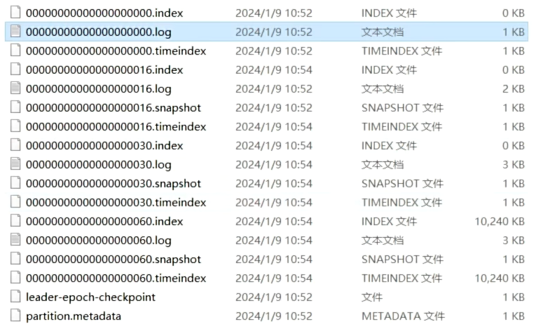
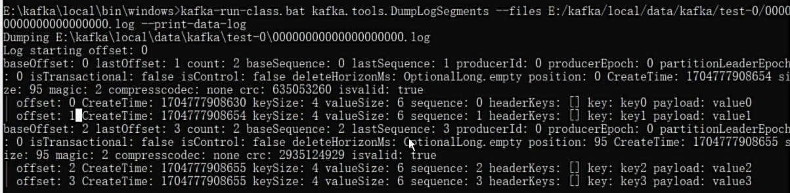
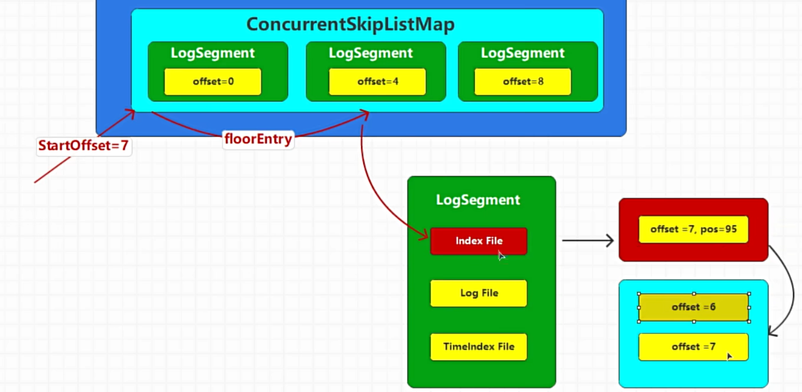
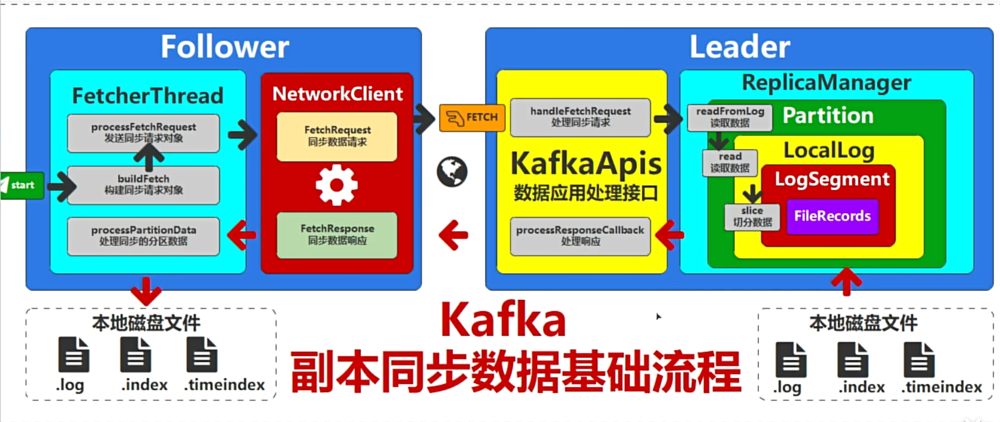
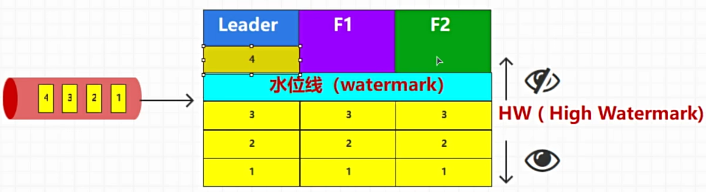

# 1. 分区和副本的存储结构

在一个多 broker 的 Kafka 集群中，topic 的分区和副本在各个 broker 上的存储文件夹分布如下：

假设有以下设置：

- 一个 Kafka 集群包含 3 个 broker（broker 0, broker 1, broker 2）。
- 一个 topic `my-topic`，有 3 个分区（partition 0, partition 1, partition 2）。
- 每个分区有 2 个副本。

### 1. 分区和副本的分布

Kafka 会在多个 broker 之间分配分区和副本。假设分配如下：

- `partition 0`：
  - leader: broker 0
  - follower: broker 1
- `partition 1`：
  - leader: broker 1
  - follower: broker 2
- `partition 2`：
  - leader: broker 2
  - follower: broker 0

### 2. 存储目录结构

每个 broker 的数据目录结构如下（假设 `log.dirs` 配置为 `/var/lib/kafka/data`）：

* Broker 0 (`/var/lib/kafka/data`)

```
/var/lib/kafka/data
└── my-topic-0  # partition 0 leader
    ├── 00000000000000000000.log
    ├── 00000000000000000000.index
    ├── 00000000000000000000.timeindex
└── my-topic-2  # partition 2 follower
    ├── 00000000000000000000.log
    ├── 00000000000000000000.index
    ├── 00000000000000000000.timeindex
```

* Broker 1 (`/var/lib/kafka/data`)

```
/var/lib/kafka/data
└── my-topic-0  # partition 0 follower
    ├── 00000000000000000000.log
    ├── 00000000000000000000.index
    ├── 00000000000000000000.timeindex
└── my-topic-1  # partition 1 leader
    ├── 00000000000000000000.log
    ├── 00000000000000000000.index
    ├── 00000000000000000000.timeindex
```

* Broker 2 (`/var/lib/kafka/data`)

```
/var/lib/kafka/data
└── my-topic-1  # partition 1 follower
    ├── 00000000000000000000.log
    ├── 00000000000000000000.index
    ├── 00000000000000000000.timeindex
└── my-topic-2  # partition 2 leader
    ├── 00000000000000000000.log
    ├── 00000000000000000000.index
    ├── 00000000000000000000.timeindex
```

### 3. 文件描述

每个分区目录包含多个文件：

- `.log` 文件：存储实际的消息数据。
- `.index` 文件：存储消息偏移量索引，以便快速定位消息。
- `.timeindex` 文件：存储消息时间戳索引，以便基于时间进行查找。
  
  

# 2. 相关配置

在 Apache Kafka 中，消息到达 leader broker 后，实际上是先写入操作系统的页缓存，然后由操作系统决定何时将数据刷入磁盘。

Kafka 允许通过配置参数来控制消息何时刷入磁盘。主要有以下几个重要的参数：

* `log.flush.interval.messages`：指定在写入多少条消息后，强制将数据刷入磁盘。默认为 `Long.MAX_VALUE`，即不基于消息数量进行刷盘。
* `log.flush.interval.ms`：指定时间间隔（以毫秒为单位），强制将数据刷入磁盘。默认为 `Long.MAX_VALUE`，即不基于时间进行刷盘。
* `log.flush.scheduler.interval.ms`：默认值为 `3000` 毫秒。这只是一个检查的频率，实际的刷盘行为是由 `log.flush.interval.ms` 决定的。当调度器检查时，如果发现已经超过了 `log.flush.interval.ms` 设置的时间间隔，就会触发刷盘操作。
* `log.segment.bytes`：控制单个日志段文件的最大大小，当一个日志段文件达到指定大小时，Kafka 会创建一个新的日志段文件，默认值1G。
* `log.segment.delete.delay.ms`：控制日志段文件在被删除之前的延迟时间。当一个日志段文件被标记为删除后，Kafka 会等待指定的延迟时间才会真正删除该文件。这为潜在的恢复操作提供了缓冲时间。默认值60000 ms。
* `log.roll.ms` 和 `log.roll.hours`：控制日志段文件的滚动时间间隔，无论日志段文件的大小如何，当达到指定的时间间隔时，Kafka 会创建一个新的日志段文件。`log.roll.hours`默认值168 小时（7 天）。
  
  

# 3. 数据文件类型



1. **.index 文件**：
   
   - **描述**：这是 Kafka 的偏移量索引文件。它用于快速查找消息在日志文件中的位置。
   - **命名格式**：`00000000000000000000.index`
   - **作用**：通过这个索引文件，Kafka 可以快速定位消息在日志文件中的物理位置，以便更快地读取消息。

2. **.log 文件**：
   
   - **描述**：这是 Kafka 的日志文件，存储实际的消息数据。
   - **命名格式**：`00000000000000000000.log`
   - **作用**：包含了生产者发送的消息内容。每个日志文件是一个分区的一部分，日志文件的命名表示消息的起始偏移量。

3. **.timeindex 文件**：
   
   - **描述**：这是 Kafka 的时间戳索引文件，存储消息的时间戳索引。
   - **命名格式**：`00000000000000000000.timeindex`
   - **作用**：通过这个文件，Kafka 可以根据时间戳快速查找消息。这个文件对于实现基于时间的消息查找非常重要。

4. **.snapshot 文件**：
   
   - **描述**：这是 Kafka 的快照文件，记录了日志段的元数据快照。
   - **命名格式**：`00000000000000000016.snapshot`
   - **作用**：用于恢复日志段的元数据，保证在崩溃恢复时能够正确地重建索引和时间戳数据。

5. **leader-epoch-checkpoint 文件**：
   
   - **描述**：这是 Kafka 用于记录 leader 选举周期的检查点文件。
   - **作用**：记录了分区的 leader 副本在不同的选举周期中的偏移量信息，帮助 Kafka 在故障恢复时确定正确的 leader 和消息偏移量。

6. **partition.metadata 文件**：
   
   - **描述**：这是 Kafka 的分区元数据文件。
   - **作用**：存储分区的基本元数据信息，如分区的 leader、replica 列表等，用于分区的管理和协调。
     
     
     
     

# 4. 数据定位原理

log等文件直接打开会乱码，使用以下工具可以解析到控制台。

```bash
kafka-run-class.sh kafka.tools.DumpLogSegments --files /path/to/log-file.log --print-data-log
```

一个log文件里面有如下内容，



Kafka 日志文件中的内容并不是简单的按行排列的消息，而是采用了批处理（batch）的方式来存储消息。


那么.index文件中可能是如下内容：

```textile
offset: 3 position: 95
```

`.index` 文件并不会为每一条消息都记录映射关系，而是每隔一定的字节数（由配置 `log.index.interval.bytes` 决定，默认4096）记录一次。




如上图，

#### LogSegment 类

`LogSegment` 主要负责一个段的日志管理。它包括：

* **日志文件（.log）**：存储实际的消息数据。
* **偏移量索引文件（.index）**：存储消息偏移量到物理位置的映射。
* **时间戳索引文件（.timeindex）**：存储消息时间戳到物理位置的映射。

#### UnifiedLog 类

`UnifiedLog` 管理一个分区的所有日志段。它通过跳表(`ConcurrentSkipListMap`)实现多个 `LogSegment` 日志的连续存储。`UnifiedLog` 的主要职责包括：

* **消息写入**：将消息追加到当前活动的 `LogSegment` 中。如果当前日志段已满，滚动到新的日志段。
* **消息读取**：根据偏移量或时间戳查找并读取消息，可能跨越多个日志段。
* **日志截断**：根据保留策略（如日志保留时间或大小），截断过期或不需要的日志段。
* **数据恢复**：在 broker 重启或故障恢复时，从日志段中恢复数据。
  
  

如图，要查询偏移量为7的数据：

1. 通过跳表定位到对应的LogSegment

2. 通过.index，经由二分法等高效定位指定偏移量的位置（如果没记录，则使用最大的小于偏移量位置）

3. 按照指定位置快速定位到偏移量7的位置（或更前面一些）
   
   

# 5. 副本数据同步



follower会定时向leader拉取数据。


#### HW水位线



水位线（HW）是 Kafka 中每个分区的一个偏移量，它表示已经被所有同步副本（leader 和 follower）确认并复制的最高偏移量。


- 数据一致性：HW 确保只有那些已经被所有同步副本成功复制的消息才会对消费者可见。这样可以防止数据不一致的问题，防止读取到未被完全复制的消息。

- 数据可靠性：HW 确保了在系统发生故障时，数据不会丢失，并且消费者读取到的数据是可靠的。如果设置了 `acks=all`，那么只有当所有同步副本都确认收到消息后，HW 才会更新。这确保了数据已经被多个副本存储，防止数据丢失。

- 故障恢复：当 leader 副本故障时，Kafka 会从同步副本中选举一个新的 leader 副本。新的 leader 会从 HW 位置开始，确保它拥有所有已提交的消息。

- 提高数据处理的可靠性和简化系统设计。生产者和消费者不需要处理复杂的数据一致性逻辑，只需依赖 Kafka 的 HW 机制。消费者读取的数据都是已经被确认的可靠数据，避免处理未确认数据带来的复杂性和错误。


#### LEO末端偏移量

LEO（Log End Offset）是 Kafka 中的一个重要概念，代表一个分区的日志末端偏移量。具体来说，LEO 是指分区中下一条待写入消息的偏移量。


#### HW更新原理

Leader会记录所有副本的LEO，以及HW。

Follower会记录自己的LEO，以及HW。


1. 消息来到Leader，Leader更新自身LEO。

2. Follower向Leader同步数据，同步发送自身LEO，Leader更新LEO数据，并更新HW。

3. Leader将数据返回到Follower，并携带HW，Followe同步HW的值，并更新自身LEO。


如此反复，LEO和HW就在不断地更新。


# 6. 数据清除

* `log.retention.hours`，`log.retention.minutes`，`log.retention.ms`：日志保留的时间。超过这个时间的日志文件将被删除。`log.retention.hours`默认值为168（即 7 天）
* `log.retention.check.interval.ms`：指定 Kafka Broker 多长时间检查一次日志文件，并根据配置的日志保留策略删除或压缩过期的日志文件。默认值：300000 毫秒（即 5 分钟）.
* `log.retention.bytes`：每个分区保留的最大日志大小，超过这个大小的日志将被删除。默认值：-1（表示没有大小限制）。
* `log.cleanup.policy`：日志清理策略，支持 delete 和 compact 两种模式。delete 模式表示根据保留策略删除旧日志，compact 模式表示日志压缩。默认值为delete。
* log.cleaner.min.cleanable.ratio：日志分段中可以被清理的最小比例。仅当分段中可清理的日志比例超过此值时，才会触发日志压缩。
* log.cleaner.delete.retention.ms：被标记为删除的记录在清理前的保留时间（以毫秒为单位）。在此时间之后，记录将从日志中永久删除。


关于 `log.cleanup.policy=compact`，因为数据会丢失，所以这种策略只适用于保存数据最新状态的特殊场景。压缩步骤如下：

1. 标记旧数据：
Kafka会通过定期扫描日志分段（log segment）来查找每个key的最新值。对于同一个key，Kafka会将旧的值标记为删除（通常是通过在记录上设置一个删除标记）。

2. 合并过程：
Kafka在后台运行一个合并过程（compaction process），这个过程会将分段中旧的key值对删除，保留最新的key值对。合并过程是增量进行的，Kafka并不会在每次写入消息时都触发这个过程。

3. 实际删除：
被标记为删除的key值对并不会立即从日志分段中删除。Kafka的压缩过程是定期进行的，时间间隔和触发条件可以通过配置参数来调整。默认情况下，Kafka会在后台线程中异步执行这个压缩过程。