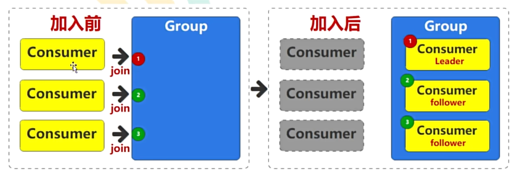

# 1. Consumer基本流程

1. 初始化消费者

首先，创建一个 Kafka 消费者实例，并设置必要的配置属性，例如 Kafka 集群地址、消费者组 ID、序列化器等。

```java
Properties props = new Properties();
props.put("bootstrap.servers", "localhost:9092");
props.put("group.id", "my-group");
props.put("key.deserializer", "org.apache.kafka.common.serialization.StringDeserializer");
props.put("value.deserializer", "org.apache.kafka.common.serialization.StringDeserializer");
props.put("isolation.level", "read_committed"); // 可选，确保事务性消息的一致性

KafkaConsumer<String, String> consumer = new KafkaConsumer<>(props);
```

2. 订阅主题

创建消费者实例后，订阅一个或多个主题，以便消费者能够从这些主题中获取消息。

```java
consumer.subscribe(Arrays.asList("my-topic"));
```

3. 轮询消息

消费者使用 `poll` 方法从 Kafka 中拉取消息。`poll` 方法会阻塞指定的时间，并返回拉取到的消息记录。

```java
while (true) {
    ConsumerRecords<String, String> records = consumer.poll(Duration.ofMillis(100));
    for (ConsumerRecord<String, String> record : records) {
        // 处理消息
        System.out.printf("offset = %d, key = %s, value = %s%n", record.offset(), record.key(), record.value());
    }
}
```

4. 处理消息

在轮询到消息后，需要对消息进行处理。处理逻辑根据具体业务需求来实现。

```java
for (ConsumerRecord<String, String> record : records) {
    // 处理消息的业务逻辑
    process(record);
}
```

5. 提交偏移量

为了保证消息不会被重复处理或丢失，消费者需要提交已经处理过的消息偏移量。可以选择自动提交或手动提交偏移量。

- **自动提交**：
  自动提交偏移量由 `enable.auto.commit` 属性控制。如果设置为 `true`，消费者会定期自动提交偏移量。
  
  ```properties
  props.put("enable.auto.commit", "true");
  props.put("auto.commit.interval.ms", "1000");
  ```

- **手动提交**：
  手动提交提供了更细粒度的控制。可以在处理完一批消息后手动提交偏移量。
  
  ```java
  try {
      while (true) {
          ConsumerRecords<String, String> records = consumer.poll(Duration.ofMillis(100));
          for (ConsumerRecord<String, String> record : records) {
              // 处理消息
              process(record);
          }
          consumer.commitSync(); // 同步提交偏移量
          // 或者使用异步提交
          // consumer.commitAsync();
      }
  } catch (Exception e) {
      e.printStackTrace();
  } finally {
      consumer.close();
  }
  ```
6. 关闭消费者

在应用程序关闭时，确保关闭消费者以释放资源。`close` 方法会确保任何未提交的偏移量被提交，并关闭网络连接。

```java
consumer.close();
```

以下是一个完整的消费者示例代码：

```java
import org.apache.kafka.clients.consumer.ConsumerRecord;
import org.apache.kafka.clients.consumer.ConsumerRecords;
import org.apache.kafka.clients.consumer.KafkaConsumer;

import java.time.Duration;
import java.util.Arrays;
import java.util.Properties;

public class KafkaConsumerExample {
    public static void main(String[] args) {
        Properties props = new Properties();
        props.put("bootstrap.servers", "localhost:9092");
        props.put("group.id", "my-group");
        props.put("key.deserializer", "org.apache.kafka.common.serialization.StringDeserializer");
        props.put("value.deserializer", "org.apache.kafka.common.serialization.StringDeserializer");
        props.put("isolation.level", "read_committed");

        KafkaConsumer<String, String> consumer = new KafkaConsumer<>(props);
        consumer.subscribe(Arrays.asList("my-topic"));

        try {
            while (true) {
                ConsumerRecords<String, String> records = consumer.poll(Duration.ofMillis(100));
                for (ConsumerRecord<String, String> record : records) {
                    System.out.printf("offset = %d, key = %s, value = %s%n", record.offset(), record.key(), record.value());
                }
                consumer.commitSync();
            }
        } catch (Exception e) {
            e.printStackTrace();
        } finally {
            consumer.close();
        }
    }
}
```


# 2. 数据消费偏移量问题

consumer默认会定时把当前消费到哪里的偏移量更新到Kafka 的内部主题 `__consumer_offsets` 中。这是一个特殊的主题，用于存储消费者组的偏移量信息。但是这会存在一些问题。比如

1. 默认每5000ms(由`auto.commit.interval.ms`决定)自动更新一次偏移量，当consumer这次拉取了100条数据，我消费到了第50条时consumer崩溃了，此时还未更新偏移量，下一次consumer启动后，会重复消费那50条数据。

2. 即使换成手动提交，也存在同样的问题，消费到一半，consumer崩溃了，还没走到手动提交那一步，kafka记录的偏移量是过时的，所有下一次consumer重启，一样会重复消费。


# 3. 事务级别的问题

即使生产者使用了事务，却仍然可以导致consumer消费到不该消费的数据。

### Kafka 的事务机制

1. **事务性生产者**：
   
   - 当一个事务性生产者开始一个事务时，它会生成一个唯一的 `transactional.id`，并通过 `beginTransaction()` 开始事务。
   - 所有在这个事务中的消息会被标记为事务性的，并且这些消息的状态（已提交或已中止）会被记录在事务日志中。
   - 当事务成功完成时，调用 `commitTransaction()`，所有的消息都会被原子地标记为已提交。
   - 如果事务失败，调用 `abortTransaction()`，所有在这个事务中的消息都会被标记为已中止，并不会对外可见。

2. **事务协调器**：
   
   - Kafka 的事务协调器负责管理事务的状态。
   - 它确保所有涉及的分区的一致性，并在事务提交或中止时更新事务日志。

### 消费者的隔离级别

Kafka 消费者有两种隔离级别：

1. **read_uncommitted**（默认值）：
   
   - 在这种隔离级别下，消费者可以读取到所有的消息，包括未提交的事务性消息。
   - 这种隔离级别可能会导致消费者读取到事务中止后的消息，从而出现消费者消费到未提交或中止事务的数据的情况。

2. **read_committed**：
   
   - 在这种隔离级别下，消费者只能读取到已提交的事务性消息。
   - 消费者会过滤掉未提交和已中止的事务消息，确保只消费到已经成功提交的消息。
   - 使用这种隔离级别可以确保端到端的精确一次语义。

```java
consumerConfig.put(ConsumerConfig.ISOLATION_LEVEL_CONFIG, "read_committed");
```

如果消费者的隔离级别设置为 `read_uncommitted`，那么它会读取到所有消息，包括未提交的事务性消息。因此，即使事务中止，消费者也可能已经读取到这些消息。


# 4. 消费者组

一个消费者组只能订阅多个主题，组内的消费者共同消费这些主题。

<mark>一个分区只能由组内的一个消费者消费</mark>。

如果消费者组的消费者数量大于topic的分区数，那么有的consumer将会空闲，用作备用。

如果小于topic分区数，那么有的消费者会消费多个分区。


当消费者组的消费者数量大于topic的分区时，此时有消费者崩溃，那么空闲的消费者会代替它，那么如何从刚才消费的位置继续消费呢？

* 当消费者处理完一批消息并提交偏移量时，会将偏移量信息写入到 `__consumer_offsets` 主题中。
* 记录的键包括消费者组 ID、主题名称和分区号，值是该分区的最新偏移量。
* 在消费者组重新平衡后，新分配到分区的消费者会从 `__consumer_offsets` 主题中读取对应的偏移量信息。
* 由于使用了消费者组 ID、主题名称和分区号的组合键，新的消费者能够准确读取到该分区的最新提交偏移量。

这些过程对于消费者都是透明的，并不需要代码手动操作。


### 分区分配策略

消费者组的平衡过程中，分区和消费者没有强绑定关系，意味着某个分区之前由消费者A消费，也许之后会由消费者B消费。

至于如何分配，是由Leader决定的，第一个加入组的消费者成为Leader（群主）。



在 Apache Kafka 中，分区具体分配给组内消费者的过程是由消费者组协调器（称为群主）决定的。Kafka 提供了多种分区分配策略，以便更好地适应不同的使用场景和需求。主要的分配策略包括：

1. **RangeAssignor（范围分配）**：
   
   - 每个主题的分区列表按照范围进行划分，将连续的一组分区分配给一个消费者。
   - 如果有多个主题，每个主题独立进行分区分配。
   - 比如5分区3消费者，就是[1,2], [3,4], [5]

2. **RoundRobinAssignor（轮询）**：
   
   - 将所有订阅的主题的分区视为一个统一的分区列表，按照轮询的方式将分区依次分配给消费者。
   - 这种策略通常能够实现较为均匀的分区分配，无论分区数和消费者数是否均匀。

3. **StickyAssignor（粘性）**：
   
   - 第一次分配后，组成员保留分配给自己的分区信息
   - 尝试在每次再平衡时保持分区分配的稳定性，尽量减少分区的重新分配。
   - 有助于减少消费者的重新分配和重启开销。

4. **CooperativeStickyAssignor（优化粘性）**：
   
   - 前面的基于EAGER协议，平衡时会让所有消费者放弃当前分区，关闭连接，清理资源，全部统一平衡。
   - CooperativeStickyAssignor 使用COOPERATIVE协议，小规模平衡
   - 基于 StickyAssignor 进一步优化，减少在再平衡过程中的分区重新分配次

5. **Custom Assignor**：
   
   - 用户可以实现自己的分区分配策略，只需实现 `org.apache.kafka.clients.consumer.ConsumerPartitionAssignor` 接口，并在配置中指定自定义的分配策略。

选择合适的分区分配策略取决于具体的使用场景和需求。例如，如果需要较高的分区分配稳定性，可以选择 StickyAssignor 或 CooperativeStickyAssignor；如果需要较为均匀的分区分配，可以选择 RoundRobinAssignor。

配置分配策略时，可以在消费者配置中指定 `partition.assignment.strategy` 属性，例如：

```properties
partition.assignment.strategy=org.apache.kafka.clients.consumer.RoundRobinAssignor
```


