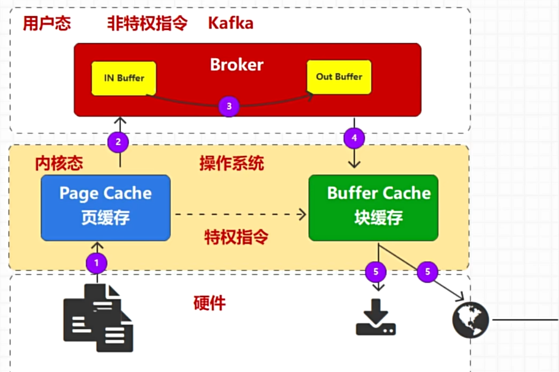
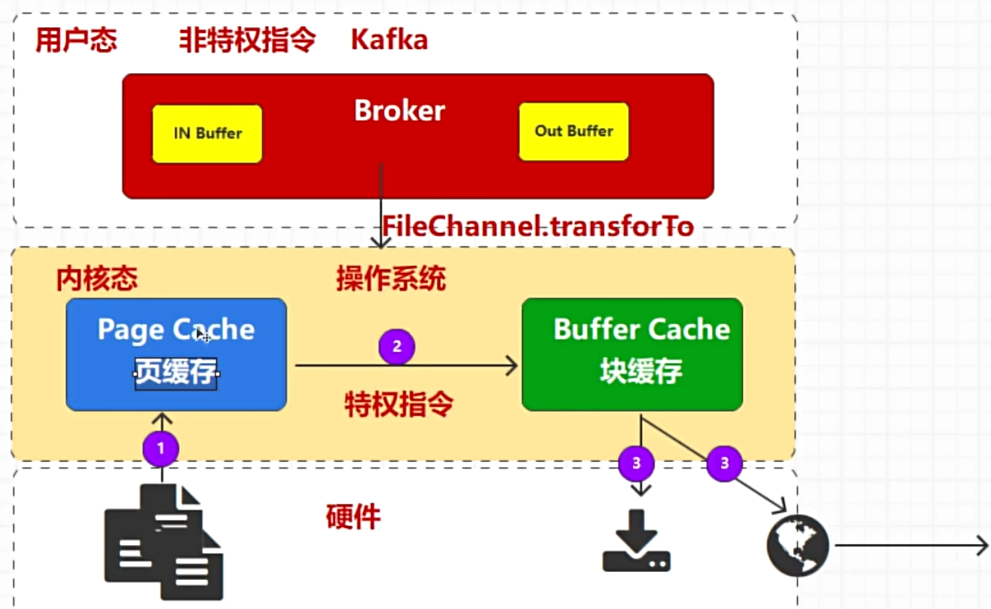

# 1. 脑裂

因为网络问题，导致kafka出现多个controller，那么剩余的broker应该认为谁是真正的controller呢？

在zookeeper中引入`controllor_epoch`，表示`纪元`，每次controller变化，都会更新纪元值，这样其余的broker就能判断出来自controller的消息哪些是真controller，哪些是可以忽略的。

# 2. 零拷贝

如下图是一种消息数据传输过程，需要把数据从磁盘中读取到页缓存，然后转化成用户态，再转移数据，再转化成内核态，在把数据传输，整个流程的效率是非常低的。

优化之后，利用系统接口调用，让数据流转不需要再内核和用户之间转化，并且流程更短，复制次数更少，效率更高。

零拷贝不是数据不经过拷贝，而是对于用户空间的Kafka来说，不需要拷贝。

# 3. 顺写日志

顺写日志是一种数据结构，其中所有的写操作都是追加（append）到日志的末尾，而不是在日志中间进行随机写入。Kafka 的日志文件采用顺写日志结构，消息被顺序地追加到日志文件的末尾，每条消息都有一个唯一的偏移量（offset）用于标识其在日志中的位置。

当生产者发送消息给 Kafka broker 时，这些消息会被顺序地追加到对应分区的日志文件末尾。顺序写入意味着磁盘的写操作可以以很高的速度完成，因为硬盘（尤其是传统的磁盘驱动器）对于顺序写入的性能非常高，远高于随机写入。

消费者从 Kafka 读取消息时，是根据偏移量从日志中顺序读取消息的。由于日志文件是顺序写入的，消费者可以高效地顺序读取消息。消费者可以选择从特定的偏移量开始读取消息，以便实现灵活的消息处理。

为了管理日志文件的大小，Kafka 将每个分区的日志文件分为多个段（segment）。当一个段达到预设的大小或时间限制时，会关闭当前段并创建一个新的段。这种分段机制使得 Kafka 能够高效地管理日志文件，同时支持日志的删除和压缩。

Kafka 的顺写日志是其高性能和高可靠性的关键基础。通过将所有写入操作顺序追加到日志末尾，Kafka 能够高效地处理大量消息，并提供持久性保证和灵活的消费模式。顺写日志的结构使得 Kafka 在分布式环境中能够简单而高效地实现复制和故障恢复，同时支持日志保留和压缩，以适应不同的业务需求。

# 4. Kafka简单优化

### 1. 操作系统

Kafka 的网络客户端底层使用` Java NI0 `的 Selector 方式，而 Selector 在 Linux 的实现是 epoll，在 Windows 上实现机制为 select。因此 Kafka 部署在 Linux 会有更高效的I/0 性能。
数据在磁盘和网络之间进行传输时候，在 Linux 上可以享受到零拷贝机制带来的快捷和便利高效，而 Windows 在一定程度上会使用零拷贝操作。所以建议 Kafka 部署在` Linux `操作系统上。

### 2. 磁盘选择

Kafka 存储方式为顺序读写，机械硬盘的最大劣势在于随机读写慢。所以使用机械硬盘并不会造成性能低下。所以磁盘选用普通机械硬盘即可，Kafka自身已经有冗余机制，而且通过分区的设计，实现了负载均衡的功能。不做磁盘组raid阵列也是可以的。使用机械磁盘成本也低得多。

### 3. 网络带宽

设计场景:如果机房为干兆带宽，我们需要在一小时内处理 1TB的数据，需要多少台kafka 服务器？

由于带宽为干兆网，1000Mbps=1Gbps，则每秒钟每个服务器能收到的数据量为1)1Gb=1000Mb
假设 Kafka 占用整个服务器网络的 70%(其他 30%为别的服务预留)，则 Kafka可以使用到 700Mb的带宽，但是如果从常规角度考虑，我们不能总让 Katka顶满带宽峰值，所以需要预留出 2/3 甚至 3/4的资源，也就是说，Kanka 单台服务器使用带宽实际应为 700Mb/3=240Mb

3)1小时需要处理 1TB 数据，1TB=1024*1024*8M6-8000000Mb，则一秒钟处理数据量为:8000000Mb/3600s=2330Mb数据。
需要的服务器台数为:2330Mb/240Mb~10 台。
考虑到消息的副本数如果为 2，则需要 20 台服务器，副本如果为 3，则需要 30台服务器。

### 4. 内存配置

Katka 运行过程中设计到的内存主要为` JVM的堆内存`和`操作系统的页缓存`，每个Broker 节点的堆内存建议 10-15G内存，而数据文件(默认为 1G)的 25%在内存就可以了综合上述，Kafka 在大数据场景下能够流畅稳定运行至少需要11G，建议安装Kafka的服务器节点的内存至少大于等于 16G。

### 5. CPU

在生产环境中，建议 CPU核数最少为 16 核，建议 32核以上，方可保证大数据环境中的 Katka集群正常处理与运行。

### 6. 集群容错

* 副本分配策略：一般建议2个及以上副本来保证高可用。

* 故障转移方案：Kafka某Broker故障后，会将其负责的分区副本转移到其他存活的Broker下，并自动选择新的主分区。

* 数据备份和恢复：kafka基于日志文件的存储方式，每个Broker上都有副本数据，可以通过配置策略来优化这部分。
  
  

### 7. 参数优化

| 参数名                                   | 默认参数值          | 位置  | 优化场景  | 备注           |
| ------------------------------------- | -------------- | --- | ----- | ------------ |
| num.network.threads                   | 3              | 服务端 | 低延迟   |              |
| num.io.threads                        | 8              | 服务端 | 低延迟   |              |
| socket.send.buffer.bytes              | 102400 (100K)  | 服务端 | 高吞吐   |              |
| socket.receive.buffer.bytes           | 65536 (64K)    | 服务端 | 高吞吐场景 |              |
| max.in.flight.requests.per.connection | 5              | 生产端 | 并等    |              |
| buffer.memory                         | 33554432 (32M) | 生产端 | 高吞吐   |              |
| batch.size                            | 16384 (16K)    | 生产端 | 提高性能  |              |
| linger.ms                             | 0              | 生产端 | 提高性能  |              |
| fetch.min.bytes                       | 1              | 消费端 | 提高性能  | 网络交互次数       |
| max.poll.records                      | 500            | 消费端 | 批量处理  | 控制批量获取消息数量   |
| fetch.max.bytes                       | 57671680 (55M) | 消费端 | 批量处理  | 控制批量获取消息字节大小 |

### 8. 压缩算法

| 压缩算法   | 压缩比率  | 压缩效率   | 解压缩效率   |
| ------ | ----- | ------ | ------- |
| snappy | 2.073 | 580m/s | 2020m/s |
| lz4    | 2.101 | 800m/s | 4220m/s |
| zstd   | 2.884 | 520m/s | 1600m/s |

# 
